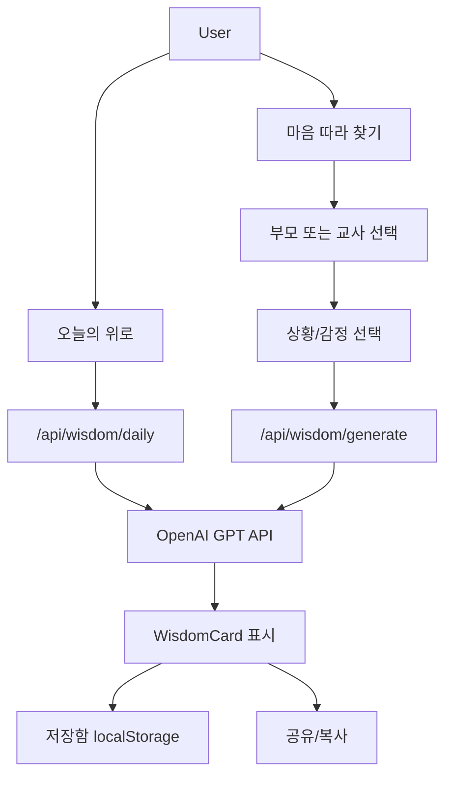
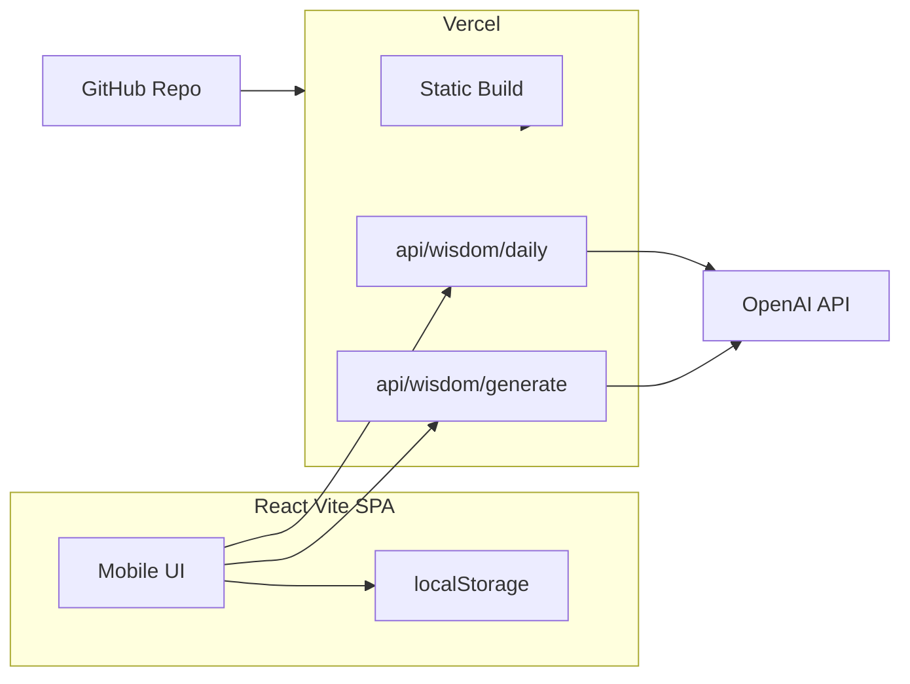

# Healing Pocket Wisdom 앱 기획

## 1. 제품 개요

| 항목 | 내용 |
|------|------|
| 앱명 | **Healing Pocket Wisdom** (힐링 포켓 위즈덤) |
| 한 줄 소개 | 부모·교사가 힘들 때 주머니 속 위로 한 장을 꺼내듯 읽는 모바일 명언 앱 |
| 대상 | 자녀 양육·학생 교육 과정에서 지치고, 자책하고, 힘이 필요한 **부모**와 **교사** |
| 언어 | **한국어 중심** (UI, GPT 프롬프트, 생성 콘텐츠 모두) |
| 플랫폼 | 모바일 웹 (PWA 가능성은 MVP 이후) |

---

## 2. 핵심 사용자 시나리오



1. **아침 30초**: 앱을 열면 오늘의 위로 한 장이 바로 보인다.
2. **힘든 순간**: "마음 따라 찾기"에서 상황(예: 번아웃, 자책)을 고르면 맞춤 명언이 생성된다.
3. **다시 읽기**: 마음에 든 문장은 저장함에 보관하고, 언제든 다시 읽는다.

---

## 3. 콘텐츠 모델 (하이브리드)

### 3-1. 오늘의 명언 (Daily)
- **하루 1개**, 모든 사용자에게 동일한 문장
- 날짜(`YYYY-MM-DD`)를 프롬프트·캐시 키에 포함
- Vercel CDN 캐시: `Cache-Control: s-maxage=86400`로 당일 재생성 방지
- 첫 요청 시 GPT 생성 → 이후 CDN/edge에서 재사용

### 3-2. 상황별 명언 (On-demand)
- 사용자가 **역할 + 상황**을 선택하면 즉시 생성
- 역할·상황은 **고정 프리셋**(자유 텍스트 입력 없음 → 프롬프트 인젝션·비용 통제)
- 생성 결과는 세션 내 히스토리에만 저장 (MVP), 저장함은 사용자가 수동 저장

### 3-3. GPT 응답 스키마 (구조화 JSON)

```json
{
  "wisdom": "2~4문장의 위로 명언",
  "attribution": "출처 또는 '오늘을 위한 한마디'",
  "reflection": "2~3문장, 공감과 해석",
  "microAction": "오늘 실천할 작은 한 가지"
}
```

### 3-4. 상황 프리셋 (초안)

**부모**
- 아이와 갈등한 뒤
- 번아웃·지침
- 자책과 죄책감
- 인내가 필요할 때
- 혼자라는 느낌

**교사**
- 학생과의 어려움
- 교권·존중 상실
- 수업·준비 부담
- 교육 의미를 잃었을 때
- 번아웃·지침

**공통**
- 작은 성장 인정하기
- 내일을 위한 힘 모으기

---

## 4. GPT 프롬프트 설계 원칙

- **톤**: 따뜻하고, 판단하지 않으며, 실용적. 설교·훈계 금지
- **금지**: 의학·심리 치료 대체 표현, 아동·학생 비하, 성별·세대 고정관념
- **Daily 프롬프트**: `"오늘({date}) 부모와 교사를 위한 위로 한 장. JSON만 반환."`
- **Generate 프롬프트**: `"역할: {role}, 상황: {situation}. 위로·격려·작은 실천 포함. JSON만 반환."`
- **모델**: `gpt-4o-mini` (비용·속도 균형, MVP에 적합)
- **temperature**: 0.8 (daily), 0.9 (on-demand) — 다양성과 일관성 균형

---

## 5. 기술 아키텍처



| 레이어 | 선택 | 이유 |
|--------|------|------|
| 프론트 | React 18 + Vite + TypeScript | 빠른 개발, Vercel 정적 배포 용이 |
| 스타일 | Tailwind CSS | 모바일 퍼스트·일관된 spacing/typography |
| 라우팅 | React Router | 3~4개 화면, 단순 SPA |
| API | Vercel Serverless Functions (`/api`) | API Key 서버 보관, CORS 제어 |
| 상태 | React hooks + localStorage | MVP에 충분, 백엔드 DB 불필요 |
| 배포 | GitHub → Vercel | 요청 스택 그대로 |

### API Key 보안
- `OPENAI_API_KEY`는 **Vercel Environment Variables**에만 저장
- 클라이언트 번들에 절대 포함하지 않음
- `/api/wisdom/generate`에 간단한 rate limit (IP 기준, 예: 분당 5회)

---

## 6. 화면 구성 (모바일 퍼스트)

### IA (정보 구조)

| 화면 | 경로 | 설명 |
|------|------|------|
| 오늘의 위로 | `/` | Daily Wisdom 카드, 로딩·에러·재시도 |
| 마음 따라 찾기 | `/explore` | 역할 → 상황 2단계 선택 → 생성 |
| 저장함 | `/saved` | localStorage 즐겨찾기 목록 |
| 소개 | `/about` | 앱 목적, GPT 사용 안내, 면책 |

### 공통 UI 컴포넌트
- `WisdomCard` — 명언·해석·microAction 카드
- `RolePicker` / `SituationPicker` — 큰 터치 영역 버튼
- `BottomNav` — 3탭 (오늘 / 찾기 / 저장함)
- `LoadingSkeleton` / `ErrorState` — 네트워크·API 실패 UX
- `ShareButton` — Web Share API + 클립보드 fallback

### 모바일 UX 원칙
- 최소 터치 영역 44px
- 본문 `text-lg`~`text-xl`, 줄간격 여유
- 팔레트: 따뜻한 베이지·세이지·소프트 블루 (눈의 피로 최소화)
- `max-w-md mx-auto` — 폰 화면 중앙 정렬
- `viewport-fit=cover` + safe-area padding

---

## 7. 프로젝트 구조 (신규 생성)

```
groom-260529-gpt-api-wisdom/
├── api/
│   └── wisdom/
│       ├── daily.ts          # 오늘의 명언 + CDN 캐시
│       └── generate.ts       # 상황별 생성 + rate limit
├── src/
│   ├── components/
│   │   ├── WisdomCard.tsx
│   │   ├── BottomNav.tsx
│   │   ├── RolePicker.tsx
│   │   ├── SituationPicker.tsx
│   │   └── Layout.tsx
│   ├── pages/
│   │   ├── HomePage.tsx
│   │   ├── ExplorePage.tsx
│   │   ├── SavedPage.tsx
│   │   └── AboutPage.tsx
│   ├── lib/
│   │   ├── api.ts            # fetch wrappers
│   │   ├── storage.ts        # saved wisdom CRUD
│   │   └── constants.ts      # roles, situations, prompts meta
│   ├── types/
│   │   └── wisdom.ts
│   ├── App.tsx
│   └── main.tsx
├── public/
│   └── favicon.svg
├── index.html
├── vite.config.ts
├── vercel.json               # SPA rewrite + api routes
├── .env.example
├── .gitignore
└── README.md
```

---

## 8. Vercel / GitHub 배포 계획

1. `npm create vite@latest . -- --template react-ts` 로 스캐폴딩
2. Tailwind, React Router 설치
3. `/api` serverless functions 추가
4. GitHub repo 생성 후 push
5. Vercel에서 GitHub 연동 → Import Project
6. Environment Variable: `OPENAI_API_KEY` 설정
7. `vercel.json` 예시:

```json
{
  "rewrites": [{ "source": "/((?!api/).*)", "destination": "/index.html" }]
}
```

---

## 9. MVP 범위 vs 이후 확장

### MVP (1차 출시)
- 오늘의 명언 + 상황별 생성
- 저장함 (localStorage)
- 공유/복사
- 모바일 반응형 UI
- API 에러·로딩 처리

### 이후 (2차)
- PWA (오프라인 저장된 명언 읽기)
- 푸시 알림 (오늘의 위로 아침 알림)
- 다크 모드
- 생성 히스토리 클라우드 동기화
- 명언 이미지 카드 생성 (OG share image)

---

## 10. 비용·운영 고려

- **Daily**: 하루 API 호출 ~1회 (CDN 캐시) → 월 비용 매우 낮음
- **Generate**: 사용자당 제한 + `gpt-4o-mini` 사용으로 통제
- **면책 문구** (`/about`): AI 생성 콘텐츠이며 전문 상담을 대체하지 않음

---

## 11. 구현 순서

1. Vite + React + TS + Tailwind 프로젝트 초기화
2. 타입·상수·GPT 프롬프트 템플릿 정의
3. Vercel API routes (`daily`, `generate`) 구현 및 로컬 테스트
4. `WisdomCard`, `Layout`, `BottomNav` UI 컴포넌트
5. Home / Explore / Saved / About 페이지 연결
6. localStorage 저장·삭제·목록
7. 모바일 스타일·접근성·에러 UX polish
8. GitHub push + Vercel 배포 + env 설정
9. README (로컬 실행, env, 배포 방법)
